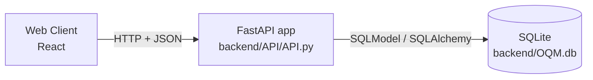
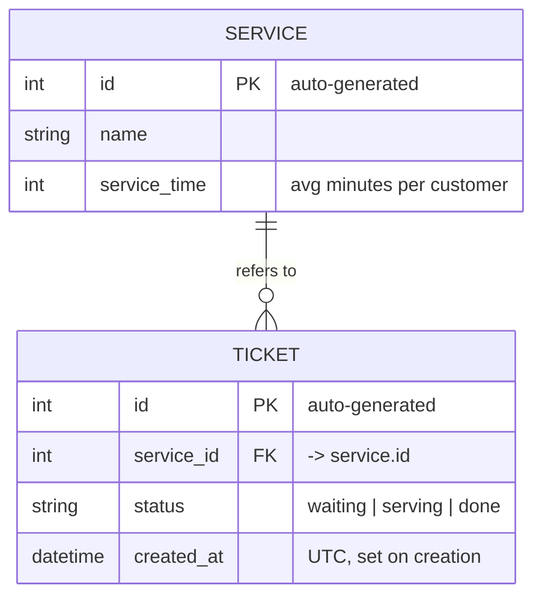
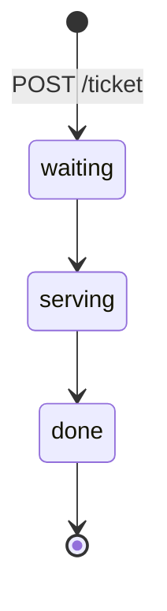

# Office Queue Management – Documentation

This document describes the current state of the project: the system design, the database, and the API endpoints. It covers only what is implemented so far.

## Contents

1. [System design](#1-system-design)
2. [Database](#2-database)
3. [API endpoints](#3-api-endpoints)
4. [Testing](#4-testing)
5. [Known issues and next steps](#5-known-issues-and-next-steps)

---

## 1. System design

### Overview

Office Queue Management (OQM) handles customer queues in an office that offers several services (for example *Shipping* and *Accounts*). A customer picks a service and gets a ticket. The ticket then waits in the queue until a counter serves it.

The project has three parts:

| Part | Folder | Status |
|---|---|---|
| Backend (REST API + database) | `backend/` | Implemented: services and tickets |
| Frontend | `frontend/` | Not started |
| Documentation | `docs/` | This file |

### Architecture



- **FastAPI** exposes the REST endpoints and validates requests and responses.
- **SQLModel** defines each table once. The same class is used as the database table and as the Pydantic model for request and response bodies.
- **SQLite** stores the data in a single file, `backend/OQM.db`, so no database server is needed.

### Tech stack

| Component | Library | Version |
|---|---|---|
|Fronted Framework | React | xxxx|
| API framework | FastAPI | 0.142.2 |
| ORM / models | SQLModel (on SQLAlchemy 2.1) | 0.0.48 |
| Database | SQLite | bundled with Python |
| Tests | pytest + `unittest.mock` | pytest 9.1.1 |

Requires Python 3.10 or newer, because the code uses `int | None` type hints. Setup and run instructions are in [`backend/README.md`](../backend/README.md).

### Backend structure

All backend code is in `backend/API/API.py`, in three sections:

1. **Models**: the `Service` and `Ticket` tables.
2. **DB setup**: the engine, the session dependency and the startup logic.
3. **Routes**: the HTTP endpoints.

### Request lifecycle

1. A request reaches a route.
2. FastAPI resolves the `SessionDep` dependency. `get_session()` opens a new `Session` on the engine and yields it.
3. The route reads or writes through the session and commits if needed.
4. The returned object is serialized with the route's `response_model`.
5. When the request ends, the `with` block in `get_session()` closes the session.

Every request gets its own session. Sessions are never shared between requests.

### Startup (lifespan)

When the app starts, the `lifespan` handler:

1. Calls `SQLModel.metadata.create_all(engine)`. This creates `OQM.db` and any missing tables. Existing tables are not changed.
2. Seeds sample services if the `service` table is empty:
   - `Shipping`, average service time 5 minutes
   - `Accounts`, average service time 10 minutes

There are no migrations. If you change a model, delete `backend/OQM.db` and restart the server so the tables are recreated. This deletes all data.

---

## 2. Database

### Connection

```python
DB_PATH = Path(__file__).resolve().parent.parent / "OQM.db"   # backend/OQM.db
engine = create_engine(f"sqlite:///{DB_PATH}", connect_args={"check_same_thread": False})
```

The path is resolved from the location of `API.py`, so the same file is used whichever directory the server is started from. `check_same_thread=False` is needed because FastAPI can run a request on a different thread from the one that opened the SQLite connection.

### Entity–relationship diagram



### Table `service`

A type of service offered by the office.

| Column | Type | Constraints | Description |
|---|---|---|---|
| `id` | integer | primary key, generated by the DB | Service identifier |
| `name` | text | required | Display name, e.g. `Shipping` |
| `service_time` | integer | required | Average minutes needed to serve one customer |

### Table `ticket`

One customer's place in the queue for a service.

| Column | Type | Constraints | Description |
|---|---|---|---|
| `id` | integer | primary key, generated by the DB | Ticket number |
| `service_id` | integer | foreign key → `service.id`, required | Service the ticket is for |
| `status` | text | default `"waiting"` | `waiting`, `serving` or `done` |
| `created_at` | datetime | default: current UTC time | When the ticket was issued |

### Relationship

- A **service** has zero or more **tickets**. A **ticket** belongs to exactly one service.
- The API checks that the service exists before it creates a ticket (`POST /ticket` returns `404` otherwise).
- SQLite does not enforce foreign keys unless `PRAGMA foreign_keys=ON` is set, and the project does not set it. The check in the API is therefore the only protection against tickets that point to a missing service.

### Ticket status



---

## 3. API endpoints

Base URL when running locally: `http://localhost:8000`
Interactive docs (Swagger UI): `http://localhost:8000/docs`

All request and response bodies are JSON. Validation errors (missing or wrongly typed parameters) return `422` with FastAPI's standard error body.

### Summary

| Method | Path | Description | Success code |
|---|---|---|---|
| `GET` | `/services` | List all services | `200` |
| `POST` | `/services` | Create a service | `201` |
| `POST` | `/ticket` | Issue a new ticket for a service | `201` |
| `GET` | `/ticket` | Get a ticket by id | `200` |

---

### `GET /services`

Returns every service.

**Response `200`**

```json
[
  { "id": 1, "name": "Shipping", "service_time": 5 },
  { "id": 2, "name": "Accounts", "service_time": 10 }
]
```

---

### `POST /services`

Creates a service.

**Request body**

| Field | Type | Required | Description |
|---|---|---|---|
| `name` | string | yes | Service name |
| `service_time` | integer | yes | Average minutes per customer |
| `id` | integer | no | Leave it out and the DB generates it |

```json
{ "name": "Payments", "service_time": 7 }
```

**Response `201`**

```json
{ "id": 3, "name": "Payments", "service_time": 7 }
```

**Errors**

| Code | When |
|---|---|
| `422` | `name` or `service_time` missing or of the wrong type |

---

### `POST /ticket`

Issues a new ticket for a service. The ticket starts as `waiting`.

**Query parameters**

| Name | Type | Required | Description |
|---|---|---|---|
| `service_id` | integer | yes | Service to queue for |

**Example**

```http
POST /ticket?service_id=1
```

**Response `201`**

```json
{
  "id": 12,
  "service_id": 1,
  "status": "waiting",
  "created_at": "2026-10-10T09:15:30.123456"
}
```

**Errors**

| Code | Body | When |
|---|---|---|
| `404` | `{"detail": "Service not found"}` | No service has that `service_id` |
| `422` | validation error | `service_id` missing or not an integer |

---

### `GET /ticket`

Returns one ticket.

**Query parameters**

| Name | Type | Required | Description |
|---|---|---|---|
| `ticket_id` | integer | yes | Ticket to look up |

**Example**

```http
GET /ticket?ticket_id=12
```

**Response `200`**

```json
{
  "id": 12,
  "service_id": 1,
  "status": "waiting",
  "created_at": "2026-10-10T09:15:30.123456"
}
```

**Errors**

| Code | Body | When |
|---|---|---|
| `404` | `{"detail": "Ticket not found"}` | No ticket has that `ticket_id` |
| `422` | validation error | `ticket_id` missing or not an integer |

---

## 4. Testing

Backend tests are in `backend/backend test/` and use **pytest** with **`unittest.mock`**.

They replace the database session with a `MagicMock` through FastAPI's `dependency_overrides`, so they never read or write `OQM.db`:

```python
@pytest.fixture
def client(mock_session):
    app.dependency_overrides[get_session] = lambda: mock_session
    yield TestClient(app)          # not a context manager -> lifespan doesn't run
    app.dependency_overrides.clear()
```

Each test sets what the mock returns, for example `mock_session.get.return_value = fake_ticket`. It then calls the endpoint and checks both the HTTP response and how the session was used, for example `mock_session.get.assert_called_once_with(Ticket, 1)`.

| File | Endpoint | Cases |
|---|---|---|
| `test_get_ticket.py` | `GET /ticket` | ticket found, ticket not found (404), missing parameter (422), invalid parameter (422) |

Run from `backend/`:

```bash
python -m pytest "backend test" -v
```

---

## 5. Known issues and next steps

**Known issues**

- `GET /ticket` returns status `201 Created`. A read should return `200 OK`. If you change it, update the assertion in `test_get_ticket.py` too.
- The `POST /ticket` and `GET /ticket` handlers are both named `get_ticket`. Routing still works, but the second definition replaces the first name in the module. Rename the GET handler, e.g. to `get_ticket`.
- `POST /services` uses the table model as its request body, so a client can send its own `id`. A separate create model without `id` would prevent this.
- SQLite foreign keys are not enforced (see [Relationship](#relationship)).
- `API.py` still contains a commented-out block of example `/cars` routes, which can be removed.

**Not implemented yet**

- Calling the next ticket and changing ticket status (`waiting → serving → done`).
- Counters, and which services each counter handles.
- Queue length and estimated waiting time (based on `service_time`).
- Frontend.